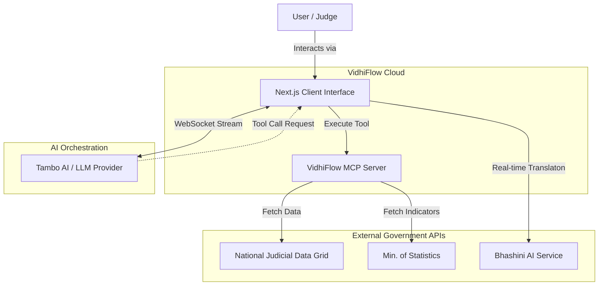
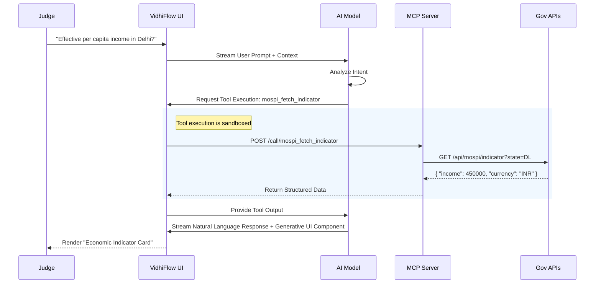

# VidhiFlow

<div align="center">
  
  
  
  
</div>

<br />

**VidhiFlow** is an MCP-native Generative UI platform designed to modernize the Indian Judiciary's digital infrastructure. By leveraging the **Model Context Protocol (MCP)**, VidhiFlow transforms static legal databases into dynamic, conversational streams where AI models can actively fetch, visualize, and analyze complex legal data in real-time.

Unlike traditional legal tech dashboards, VidhiFlow uses an **adaptive interface** that renders specialized components (Case Cards, Summons, Summaries) on-demand based on the context of the conversation.

---

##  System Architecture

VidhiFlow utilizes a distributed architecture separating the conversational UI from the tool execution layer. This ensures that the frontend remains lightweight while the **MCP Server** handles secure, structured interactions with government APIs.



###  Interaction Flow (The x-MCP Protocol)

When a legal professional asks a question, the system follows a strict orchestrator pattern to ensure accuracy and data provenance.



---

##  Key Features

###  Generative UI Engine
The interface is not pre-built; it is **generated**.
- **Dynamic Components**: If the AI discusses a case, a `CaseStatusCard` is rendered. If it discusses a witness, a `SummonsDraft` appears.
- **Context-Aware**: UI adapts to the stage of the legal proceeding (e.g., Pre-trial vs. Evidence).

###  Standardized MCP Server
A dedicated Node.js server implementing the Model Context Protocol standards.
- **Tool Isolation**: Tools run in a separate environment from the rendering engine.
- **Type Safety**: All tool inputs and outputs are validated via Zod schemas.

###  Judicial Integrations
- **NJDG (National Judicial Data Grid)**: Real-time fetch of case titles, hearings, and status.
- **MoSPI**: Integration with economic databases for calculating compensation and fines based on inflation and per-capita income.
- **Bhashini**: Government of India's AI translation stack for breaking language barriers in courtrooms.

---

##  Tech Stack & Microservices

| Service | Technology | Role |
| :--- | :--- | :--- |
| **Frontend** | Next.js 14, React, Tailwind | Conversational UI, Generative rendering |
| **Orchestration** | @tambo-ai/react | AI Stream management, Component hydration |
| **Tool Server** | Node.js, MCP SDK | Tool definition, API proxying, Validation |
| **Validation** | Zod, Valibot | Runtime schema validation for tool inputs |
| **Design System** | Lucide React, CSS Variables | Custom "High-Trust" Slate/Indigo theme |

---

##  Getting Started

###  Prerequisites

| Dependency | Version | Requirement |
| :--- | :--- | :--- |
| **Node.js** | v18.17+ | Core runtime |
| **npm** | v9+ | Package management |
| **Git** | Latest | Version control |

###  Installation

1.  **Clone the repository**
    ```bash
    git clone https://github.com/Pixie-19/VidhiFlow.git
    cd VidhiFlow
    ```

2.  **Install dependencies**
    ```bash
    npm install
    ```

3.  **Configure Environment**
    Create a `.env.local` file in the root directory:
    ```bash
    # LLM Provider Key (Required for AI features)
    NEXT_PUBLIC_TAMBO_API_KEY=your_api_key_here
    ```

###  Running the Stack

You need to run both the Frontend and the MCP Server for full functionality.

**Option 1: Unified Dev Command (Recommended)**
```bash
npm run dev
# Starts Next.js on localhost:3000
```
*Note: In development, the MCP server is currently embedded or run alongside via scripts defined in `package.json`.*

**Option 2: Microservice Split**
Terminal A (Frontend):
```bash
npm run dev
```

Terminal B (MCP Server):
```bash
npm run mcp:serve
```

---

##  MCP Tool Reference

The `vidhiflow-mcp` server exposes specific capabilities to the AI model.

### 1. `njdg_fetch_case`
Retrieves case metadata from the National Judicial Data Grid.

| Parameter | Type | Description |
| :--- | :--- | :--- |
| `caseNumber` | String | The specific court case number (e.g., `O.S. 25/2023`) |
| `diaryNumber` | String | The filing diary number (optional) |
| `courtCode` | String | Unique identifier for the specific court establishment |

### 2. `mospi_fetch_indicator`
Fetches economic indicators for legal calculations.

| Parameter | Type | Description |
| :--- | :--- | :--- |
| `indicator` | String | Code for the metric (e.g., `per_capita_income`) |
| `stateCode` | String | ISO state code (e.g., `DL`, `MH`) |
| `year` | Number | Financial year for the data |

---

##  Contributing

We welcome contributions to improve access to justice through technology.

1.  Fork the repository
2.  Create your feature branch (`git checkout -b feature/AmazingFeature`)
3.  Commit your changes (`git commit -m 'Add some AmazingFeature'`)
4.  Push to the branch (`git push origin feature/AmazingFeature`)
5.  Open a Pull Request

##  License

This project is licensed under the **MIT License** - see the [LICENSE](LICENSE) file for details.
